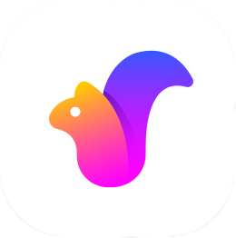
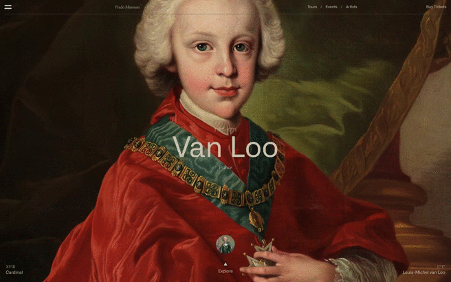

  
  
    
  
  

<h2 align="center">Description</h2>

The template is a site for viewing the works of great artists represented in the famous Prado Museum. You can also find out information about the painting and the artist himself.
- To launch the app:
  - download the repository;
  - log in to the downloaded repository using the command line or terminal;
  - enter the command line 'npm run start' or 'serve-s build' and go to the address specified in the terminal.

* Note that the project was made using the CREATE REACT APP.

- [Demo](https://kerthin.github.io/pradoMuseum-templateSait/)

#### Use technology.

The following technologies were used to create this project:

<h3 align="center">Software platform</h3>
<!--Software platform start-->

  

<h3 align="center">Libraries</h3>

<!--Libraries-->

  

<h3 align="center">Package manager</h4>

<!--Package manager-->

  

---

## Documentation

#### The repository of this project is divided into several sections:

- `src` - this repository is intended for files with the help of which the project is being developed. It is from this repository that all project files are compiled;
- `docs` - a repository that stores all compiled code with all media files;

#### The following describes in more detail the repository `src`:

- `src` - this repository is divided into several folders and files:

  - `fonts` - folder is used to store fonts;
  - `image` - all images for the site are stored in the folder.

- `public` - media files distributed by subgroups are stored inside this repository.

#### This section describes how to work with `Create React App` used in the project:

- `npm run start` - this command starts the project from the local 'src' repository where you work on the entire product;
- `serve -s build` - this command starts the project from the local 'build' repository where the finished and assembled project is located for release in production.

## Appearance

The image of the website:

- Gif

#### Gif

  - Image Choise  
  

  - Synopsis  
  

  - Horizontal Scroll  
  

  - Vertical Scroll  
  
